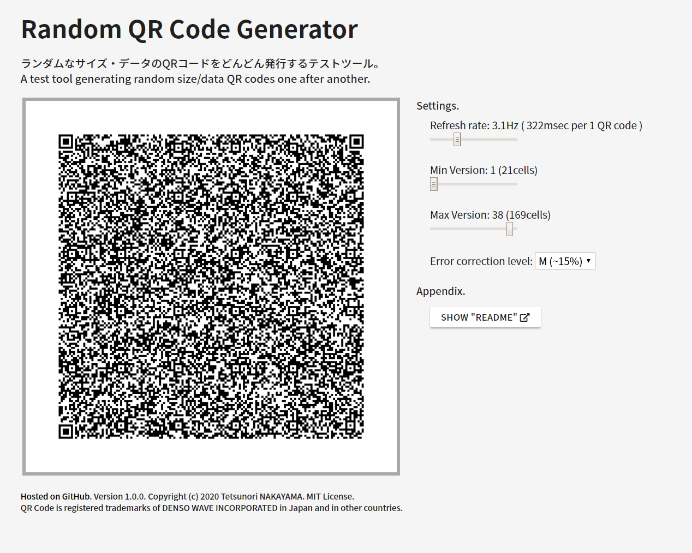

# Random QR Code Generator
Version 1.0.0  

# Description
Random QR Code Generator.   
You can also capture and download image as a PNG file. Furthermore, you can decode QR codes, now.  
See [this article](https://qiita.com/tetunori_lego/items/4d0da075224abbaa4389) in detail. You can try [here](https://tetunori.github.io/HTML5WebcamTester/).

# Usage
1. 111
2. 2222.
3. 3333

# Licence
This software is released under the MIT License, see LICENSE.

# Author
Tetsunori NAKAYAMA.

# References
QR code generation
https://qiita.com/dojyorin/items/78c22be5411ad68cdff9#writer

node-qrcode @oldair
https://github.com/soldair/node-qrcode

Icon  
https://material.io/resources/icons/

UI parts  
https://www.muicss.com/
